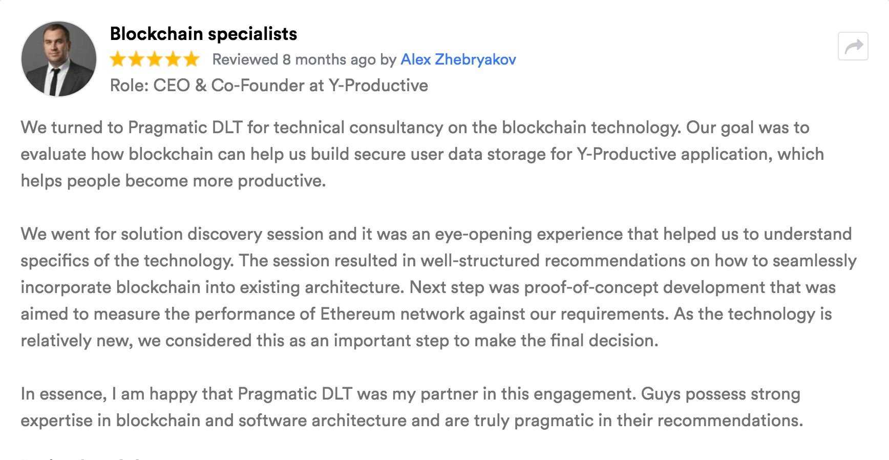

Focusing on providing helpful, transparent advice and high-quality Blockchain solutions to the clients in different geographies facilitates Pragmatic DLT as the top Blockchain solutions provider in Canada at GoodFirms.

View the [Pragmatic DLT's GoodFirms'](https://www.goodfirms.co/company/pragmatic-dlt-inc/ "Pragmatic DLT's GoodFirms'") profile to get the insights of the company and its way of crafting and catering solutions to global clients.

### About Pragmatic DLT

Rich in providing to the clients with the best possible solutions in Blockchain technology, Pragmatic DLT founded in 2018 is headquartered in Canada. The company also has its research and development center based in KYIV, Ukraine. Pragmatic DLT is an innovative software development company mainly indulged in delivering Blockchain services to clients of different verticals in different geographies. The professionals at Pragmatic DLT produces the technology paving the way for entrepreneurs to use efficient blockchain services that help them run their businesses smoothly. Furthermore, the company aims at delivering excellent clientele experience through an extensive logistics base, aimed at building a good repeat customer franchise. Moreover, with years of experience, Pragmatic DLT has specialized in fintech business consulting and is also looking forward to engaging in a peer-to-peer economy.

### GoodFirms and Its Research Process

GoodFirms is a fully established analysis and review portal that encourages service seekers to pick the best services. Moreover, it supports IT companies and software manufacturers to enhance user acquisition stats, market share, and brand awareness.

With its up-to-the-minute and reliable research process, GoodFirms has been monitoring and reviewing companies & software merchandise that could be of advantage to the business people. The research is mainly based on three parameters – Quality, Reliability, and Ability. Likewise, GoodFirms' research unit also assessed Pragmatic DLT for its Blockchain services, which as per the team has stood in the frontline as the top Blockchain development companies in Canada and will soon accelerate in the global list as the best amongst them.

### Pragmatic DLT's Service Offerings

The developers at Pragmatic DLT create detailed and self-governing solutions for business people by using Blockchain as a center, which produces a real impact on the competitive market. From concept to achievement, the expert professionals at the company can yield a 360 shift to the purchasers' company by executing Blockchain Technology. The functioning of Pragmatic DLT includes thorough market research, entire project assessment, and ruling out the best Blockchain platforms to assist the buyers. Moreover, the professional developers at the company try to operate more smartly to give end-to-end personalized Blockchain solutions for every domain. Thus, by arranging intensive sittings to draft out a structure for giving the best solution by the team endows Pragmatic DLT to thrive amongst the best [Blockchain developers in Canada](https://www.goodfirms.co/directory/country/list-blockchain-technology-companies/canada 'Blockchain developers in Canada') listed at GoodFirms.

The below-displayed review is the evidence of the high-quality service offerings rendered to the clients by the developers at Pragmatic.

Moreover, the expert developers at Pragmatic DLT does iterative research and development, which mainly focuses on the validation of the hypothesis to clarify the solution of the particular project of clients' business. Later on, the SWAT team develops a demo which gives a clear picture of the plan outlined by the developers and which can be published with the clients' approval. With this, the developers' team works closely with the client to match their requirements. Also, the team remains updated with the new trends and features that can be later on added to the project to enhance the project as well as clients' business credibility. Thus, oozing out the best expertise by the developers' team makes the GoodFirms' research team believe that Pragmatic DLT will soon be one of the top [Blockchain technology companies](https://www.goodfirms.co/directory/services/list-blockchain-technology-companies 'Blockchain technology companies') amongst the listed ones at GoodFirms.

### About GoodFirms

Washington, D.C. based [GoodFirms](https://www.goodfirms.co/ 'GoodFirms') is a maverick B2B research and reviews company that helps in finding Blockchain development agencies rendering best services to its customers. GoodFirms’ extensive research process ranks the companies, boosts their online reputation and helps service seekers pick the right technology partner that meets their business needs.

### About the Author

Anna Stark is presently working as a Content Writer with GoodFirms – Washington D.C. based B2B Research Company, which bridges the gap between service seekers and service providers. Anna’s current role lingers her to shape every company’s performance and critical attributes into words. She firmly believes in the magic of words and equips new strategies that work, always in with ideas, something new to carve, and something original to decorate the firm’s identity.
