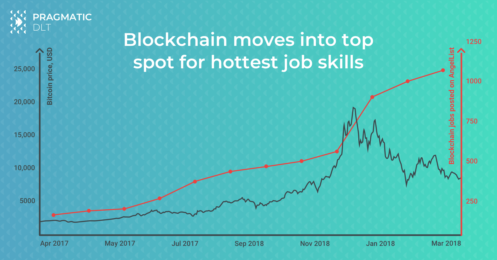

# How to hire team of blockchain developers

Tina and her team did an ICO in May. They hit the hard cap of $12m and celebrated success, taking a few weeks' break from the rush. After the dust settled and founders' LinkedIn cooled down from the overwhelming flow of 'kudos' and business offers, the team sat in the office to plan the next steps.

One thing became obvious - they are not set to build a product. The thing there that the team has a vision, a clear plan, and strategy. They investigated main pitfalls and selected an underlying technology. Rob, the CTO even posted a few jobs online but got no response.

If this sounds familiar, you are not alone. Even though the [average salary of a blockchain engineer in Silicon Valley is $158,000](https://www.forbes.com/sites/shermanlee/2018/04/11/the-demand-for-blockchain-engineers-is-skyrocketing-but-blockchain-itself-is-redefining-how-theyre-employed/#6f556ebc6715), programmers who have experience in Solidity (language for creating smart contracts) is in short supply and high demand.

The language itself is not too complicated and has a syntax similar to extremely popular JavaScript. But there are differences. The main difference is the concept of blockchain smart contracts that Solidity was developed for. In order to make solid dApp (application running in a decentralized peer-to-peer network) you need to clearly understand specifics of:

- peer-to-peer synchronization;
- the concept of the ledger as opposed to relative DBs;
- specific DLT implementation.
- And there is way less offer than demand for such specialists.

As Jeremy Drane, Director of PwC Fintech, [noted](https://www.coindesk.com/consulting-firms-hiring-blockchain-talent/),

> “The number one issue facing the blockchain industry today is a lack of talent.”

Juliet Kasko, co-founder of [CxO Executive Search](http://www.global-cxo.com/) and [realadvisors.co](https://realadvisors.co/), commented: “This applies not only to the technical roles. There is an overall lack of the professionals who would be willing to join a blockchain company, as a level of awareness about the industry is low and the prejudice is still high. At the same time, well-financed projects, especially in regulated industries need to hire professionals with extensive corporate experience to join them, like the head of Legal & Compliance, CFO. An essential part for many blockchain products is marketing and finding CMO with the skills that are applicable and transferable for blockchain”.

Such a situation has obviously overheated the market. If you need solid B2B application you would normally set R&D unit to be at least 2-3 teams of 5-7 folks who know the domain. This, of course, assumes that you already have a senior technical team or at least CTO/Architect in.”

[CryptoCoin News reported](https://cryptocoin.news/news/more-blockchain-ready-developers-needed-iohk-trains-students-in-haskell-code-3491/) that in November 2017, the number of blockchain-related LinkedIn job postings had more than tripled over the past year.

By the fall of 2017, [CoinTelegraph was reporting](https://cointelegraph.com/news/cryptocurrency-job-openings-double-in-last-6-months) that cryptocurrency-related jobs had doubled in the six months prior.

Despite the popular belief, such high demand is not related to cryptocurrency hype. See below how a number of blockchain-related openings, posted on [AngelList](https://angel.co/newsletters/bitcoin-is-not-dead-041918), has not correlated to the BTС price chart.

Take IBM itself, as an example. The company is [already working with clients on 400 projects](https://developer.ibm.com/dwblog/2017/blockchain-jobs/) that span financial services, food safety, supply chain and logistics, retail and consumer identity industries, just to name a few.

Those projects employ more than 1,600 employees (and growing!), and IBM, who was recently named the #1 blockchain vendor by Juniper Research, currently has more than 150 job openings related to the blockchain.

It is not a dead end in any way and thousands of companies claim to do development of dApps continuously. Moreover, in a situation of scarce resources and fresh market one has the best chances for the leap.

Our folks have to be inventive in such situation. Here are a few options we would recommend:

### Teach them yourself

Running an academy is a good way to either teach your existing employees a new skill or invite curious folks from the market to make a job offer to the best ones.

The prerequisite for running such a course will be your possession of solid expertise in-house, or at least, you need to be able to invite an external trainer.

IBM offers personalized online training for employees who work in the blockchain, or for those employees who want to break into the field. The company also has an internal blockchain community which has more than 5,000 active members who share updates, insights, and discussions on the latest in blockchain technology.

IOHK (software development company, founded by [Charles Hoskinson](https://iohk.io/team/charles-hoskinson/) and [Jeremy Wood](https://iohk.io/team/jeremy-wood/)) trains students for blockchain jobs at coding and cryptocurrencies summer course. It aimed to give on-the-job training to the students, mostly in their fifth year at the National Technical University of Athens School of Electrical and Computer Engineering and some from the University of Athens.

IOHK said that it intends to offer selected graduates from the program full-time positions in its newly established Athens Haskell Team. The new team will complement IOHK’s global network of blockchain research and development laboratories at the University of Edinburgh and Tokyo Institute of Technology that bring together academics and students to collaborate on industry-inspired problems.

[Pragmatic DLT](https://pragmaticdlt.com/), Canadian software development company focused on blockchain with an R&D center in Ukraine, organized Ethereum Developer Course in Kyiv, Ukraine in August 2018. The course was run over the weekends during the holiday season in Ukraine, however, it still was well-sold and attended. Such course helped the company to fulfill its mission to contribute to the community and to grow. Pragmatic DLT appreciates results and, despite the overhead for the organization, are planning to run another iteration later this year.

Running an Academy definitely makes sense to get new hires. However, one should mind significant overhead for the organization, fact that you will not get experienced blockchain developers right out of it and that initial pre-screening is required to get quality candidates out of it.

Otherwise, it’s worth just sending your engineers to external courses, fortunately, there are many of them:

- https://www.udemy.com/best-solidity-tutorial-course-ethereum-blockchain-development
- https://www.coursera.org/courses?query=solidity
- https://pragmaticdlt.com/onlineacademy.html

#####

### Bounty and per-case rewards

PHOTO BY ALEX KOTLIARSKYI VIA UNSPLASH

On a market, with serious scarcity, one may need to think out of the box. Other options to get the job done is not necessarily mean to acquire new employees. You may rely on external expertise, especially for tasks that are not recurrent or does not require the developer to be available at a short notice on a long period of time.

For example, Ethereum has been running a bounty program for developers who find bugs and security flaws since 2015. The top contributor, Martin Holst Swende, was invited to Ethereum foundation and, despite not being eligible for bounties anymore, now manages the bug bounty program from another side of the barricades.

IoTeX, the Privacy-Centric Blockchain for IoT, is active ETH contributor. IoTeX has taken up large charity initiative to fund blockchain research. [One of the founders, Jing Sun, told Sherman Lee](https://www.forbes.com/sites/shermanlee/2018/04/11/the-demand-for-blockchain-engineers-is-skyrocketing-but-blockchain-itself-is-redefining-how-theyre-employed/#6f556ebc6715) of Forbes that it is a misconception to think blockchain research is well-funded. The majority of grants in an academic setting are given to prominent researchers with a lot of existing resources. The mission of IoTeX is to close the funding gap between a tenured professor and a young professor starting his career or a developer hacking his way through the next breakthrough.

A bug bounty is a very popular model among software security experts. That’s why [Haken](https://hacken.io/), global tokenized business with operating cybersecurity products, built up marketplace platform. One may post a request for security audit on the marketplace. Such request will be picked up by white-hat hackers or other security experts that will perform the job to be awarded the bug bounty. The platform is pretty popular for some type of services, for example, it’s widely used for smart contract audits.

In short, bounty-founded engineering is growing in popularity among DLT-enabled businesses. It is specifically fuelled by ideas of decentralization and well fit for new-age businesses. Bounty-like rewards can be also applied by more classical organizations, however, one should mind that it is not a good fit for jobs that would repeat itself or are related to core business logic. Also, the bounty reward will normally be higher than the price you’d get on a freelance platform. They are great for rewarding audits, exploits, RnD results and any others where a high level of creativity is required and publicity is beneficial.

### Professional service

  
Look for professional services is normally another option that pops up in mind after you got difficulties hiring. However, using such companies for blockchain development is tricky. Software development companies are normally offering variations of one of the following engagement models:

- Project Development. Get your quote based on skills and scope, fix it in the contract and eventually get the software done.
- “Time and material”. Order required skills, get the hourly rate and use the person as you wish within agreed time limits.
- “Own Development Team”. Engagement model with potentially the most engaged personnel - folks being hired by your request. You know each person, their profile, and salary. You work with them directly and service provider offers only hosting, not interfering the daily routine.

Does any of those sound good to you to help Tina and the team to do the product of their dreams? Whilst Project Development and T&M will obviously suffer from lack of commitment, crucial for startups, the ODC option may work. But the lead time to get it up&running is usually a 3-4 month. This might be an issue for blockchain-enabled startups, given the current pace of innovation in the field. The whole market is 2 years old, after all!

Fortunately, the market is wise and self-balanced and if there is a need and the money - service is up there. Look no further than combined models of Applied Blockchain, Pragmatic DLT or even Accenture. Those models marry technical consulting and software delivery in the way that is intuitive will work for our guys.

Consulting-based model is starting from identifying the idea, the basic needs, and boundaries of the project. Consulting firms that specialize in the blockchain, has vast experience with distributed technology and concept of decentralization. Also, such firms may help you select tech stack. It’s very important to make the right bet with it, especially given extremely rare production-ready applications. In fact, there are only few that prove itself working, while the market is overwhelmed with hundreds of frameworks that promise heaven on earth.

Based on initial screening, there is usually proof of concepts required. Ethereum mainnet is capable of ~15 payments a second. If your transactions are not just a payment - prepare it to be either very expensive or very slow. Technology in many cases is not really up there for the current business needs. Again, there is a lot of delusion on the market and hundreds of frameworks claim they will fix main pain points pioneers suffer from.

> "..We have tested few most promising frameworks, implementing average supply chain scenario. We did sets of load tests to check if the claims on websites are real. In a majority of cases, we did not manage to reproduce advertised results. One should be very careful, selecting the underlying technology"

> says Artem Oleshko, CTO of Pragmatic DLT.

Set of properly designed proof of concepts will allow you to practically validate what fits your business in fact.

When you are clear about design and tech stack of your system - Minimal Viable Product is something market is looking for right now. 2017-2018 were years where the bunch of glib-tongued dreamers with a nice website could raise millions. Some say that 80% of the ICOs [conducted in 2017 were a scam](https://cointelegraph.com/news/new-study-says-80-percent-of-icos-conducted-in-2017-were-scams) and the majority of the project failed [within 4 month from their token sales](https://www.coindesk.com/over-half-of-icos-fail-within-4-months-suggests-us-study/). No surprise that modern investors fed up of empty promises and are looking for projects with at least some developments to demonstrate. Doing a solid MVP in such regard will clearly be a good move.

### So what should Tina do?

Tough call. Nonetheless, options are pretty clear. One should definitely have its own CTO as a part of the team. Traditionally, startups start from hiring friends and family (similar to 3F’s to raise funds from, skipping the first F :)) This works well until certain stage of project development, however not acceptable for CTO. One should hire well experienced CTO either full time or at least on a advisory/consulting basis to help to move the project forward. Preferably with blockchain experience.

> Juliet Kasko, whos business is to help on the matter, recommends:
>
> “You can find such a professional via professional headhunting companies. Their job is to find candidates based on your criteria for full time, or, connecting you with a global talent pool in advisory role, as there is a lot of curiosity in a blockchain sector but not yet readiness leaving a stable, well paid job, to join a promising, at least on a “white paper” startup.”

To find Rob, Tina has reached out to a professional headhunting company, combined with a tech consulting company helping to evaluate his technical skills. Once technical employee Number One is aboard, folks may start hiring or teaching others.

When time is of an essence and Tina wants to ramp up production, a good option would be to engage with the professional software development firm. One of the offered formats we came across is when a tech consulting company “lends” their team members to work on your product development, being CTO at the same time (if you trust them enough to take ownership). They help you to hire and train the team. Once you’re ready to “fly” on your own, when the team is in place together with MVP - the project lead goes back to his company.

Whatever is the way Tina choose, we wish her the best of luck! We truly believe that society will benefit if more talented entrepreneurs with fresh ideas will be enabled to accelerate innovations in finance, logistics, and many other outdated industries.

You are always welcome to reach out for advice to one of our [Pragmatic DLT SWAT Teams](https://pragmaticdlt.com/) or [teach your developers coding on Ethereum](https://pragmaticdlt.com/onlineacademy.html). We are open to inquiries of any kind and will be happy to help you navigate in such a dynamic domain as distributed ledger technologies.
