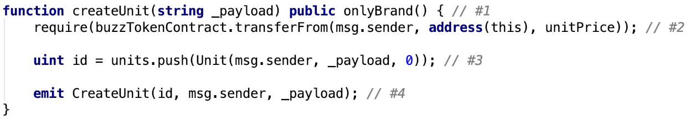
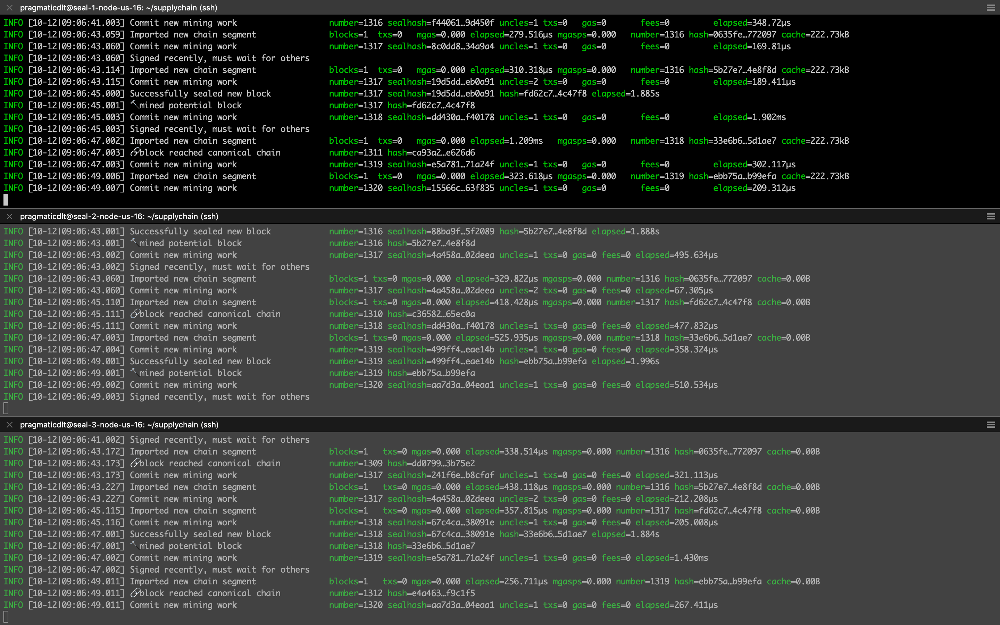
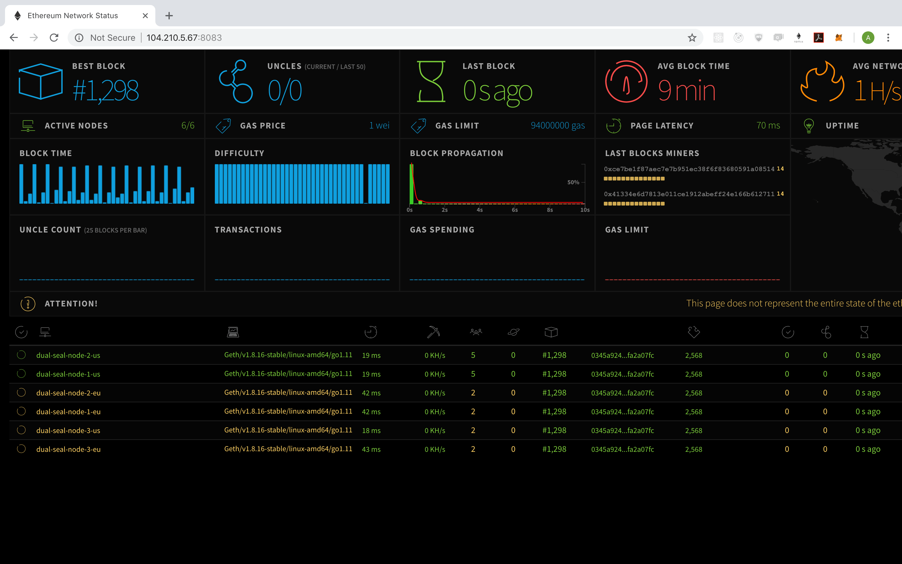
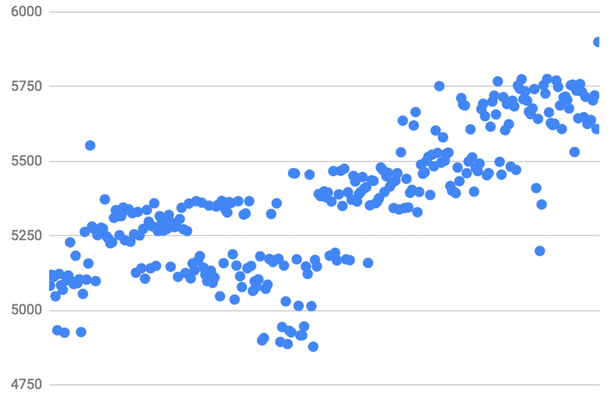
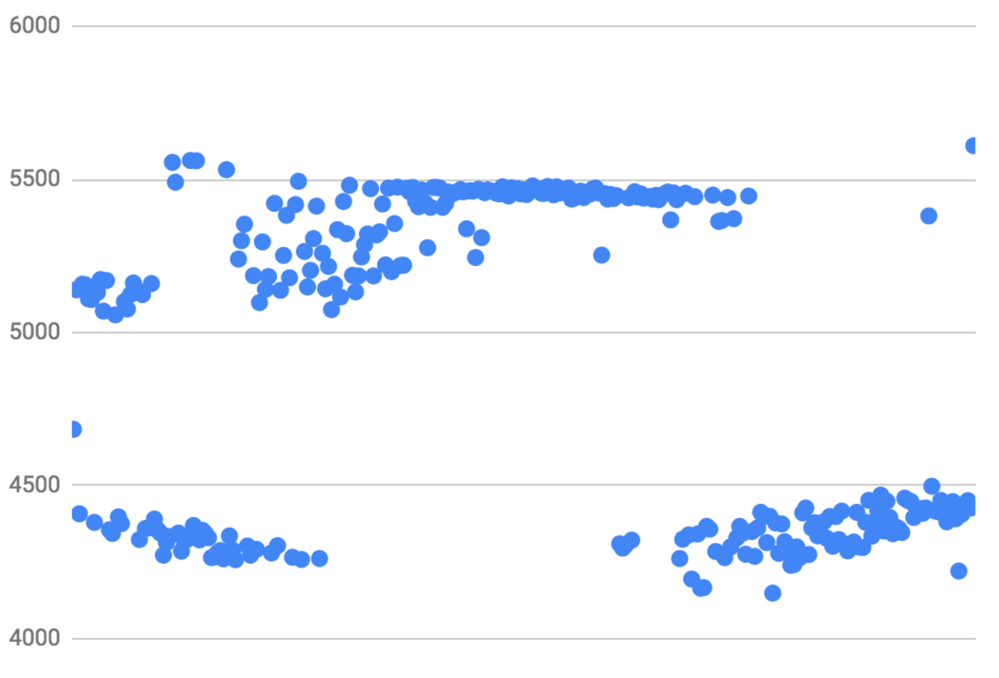

# Setup private Ethereum network in cloud

This insight is a step by step guide how to launch private Ethereum network. It is a great starting point to start experiments and play with different setup and configuration options for your specific needs (block creation time, number of nodes per availability zone, block target gas limit, etc...).

### Private chain

A private chain can potentially have huge advantages over public - level of control we get is much higher. Designing architecture for specific business needs, with private network setup we have more flexibility around transaction cost, latency and other quality attributes.

### Key points about Ethereum Clique

Ethereum Clique is Proof-of-Authority consensus algorithm implementation deployed to Rinkeby test network. PoA is a near perfect fit for private networks as it gives us full control over which nodes can seal (validate/create) blocks on the network. There are number of pre-approved seal nodes (validators) defined in genesis file. Addition of the new seal node requires voting by existing seal nodes.

There are three essential rules to note before we start:

K - number of seal nodes on chain,  
N - number of produced blocks

1. Chain will produce new blocks until floor(K2+1) of seal nodes are online
2. Node picked up to validate next block is defined as N mod K.
3. Node can be picked up as validator if last  floor(K + 12)  blocks was not validated by it

### Test scenario

A few words about how our test transaction looks like. In a nutshell it represents the following scenario:

Given​ user logged in as brand  
And​ balance is 100 tokens  
When​ user types unit name  
And​ clicks create  
Then​ unit appears in unit list  
And​ balance is 99 tokens

Scenario is implemented in the smart contract in the following way:

Under the hood the following business logic comes into play:

1. Check that sender has brand role (modifier)
2. Charge unitPrice as a fee from sender (erc20)
3. Create unit and save to array (update contract state)
4. Communicate what happened off-chain (emit event)

### Setup manual

##### 0. Prerequisites

As cloud platform we use Microsoft Azure. BTW, It kindly offers 200$ as trial option. We created 8 VMs in two regions. 4 VMs withing one availability zone of Central US region and three others within France Central. Each VM([DS1_v2](https://docs.microsoft.com/en-us/azure/virtual-machines/windows/sizes-general)) has 1 vCPU, 7GB SDD, 3.5GB of RAM and Ubuntu 16 on board. Plus, a separate VM to deploy the Ethereum statistics. There is a list of machines needed for experiment with some useful info in the name (it's a good idea to note IP address next to VM name):

1. boot-node-us
2. seal-1-node-us
3. seal-2-node-us
4. seal-3-node-us
5. boot-node-eu
6. seal-1-node-eu
7. seal-2-node-eu
8. seal-3-node-eu
9. stats-node

##### 1. Install go (to each node):


$ curl https://dl.google.com/go/go1.11.linux-amd64.tar.gz > go1.11.linux-amd64.tar.gz
$ sudo tar -C /usr/local -xzf go1.11.linux-amd64.tar.gz
$ mkdir ~/.go


add to /etc/profile:


GOROOT=/usr/local/g    
GOPATH=~/.go  
PATH=$PATH:$GOROOT/bin:$GOPATH/bin



$ sudo update-alternatives --install "/usr/bin/go" "go" "/usr/local/go/bin/go" 0  
$ sudo update-alternatives --set go /usr/local/go/bin/go  
$ go version


##### 2. Download and build go-ethereum (on each node):


$ sudo apt-get update  
$ sudo apt-get install -y build-essential  
$ git clone https://github.com/ethereum/go-ethereum  
$ cd go-ethereum  
$ git checkout tags/v1.8.16` (`git tag -l`)  
$ make all  


##### 3. Setup ethstats

In order to do this the best option is to use puppeth. First, install docker to stats-node:

$ curl -fsSL https://download.docker.com/linux/ubuntu/gpg | sudo apt-key add - 
$ sudo apt-get install docker-compose 
$ sudo usermod -aG docker $USER 
$ relogin 


Then, run puppeth and follow CLI instructions to deploy ethstats:

$ ~/go-ethereum/build/bin/puppeth


##### 4. Setup seal-node-n (repeat to all seal nodes)


$ mkdir -p ~/supplychain/seal-node-n


Create a bunch of tests accounts - create at least 2-3 accounts.

$ cd ~/supplychain 
$ ~/go-ethereum/build/bin/geth --datadir seal-node-n/ account new


##### 5. Create `genesis.json` using puppeth (run puppeth on stats-node and follow CLI instruction to generate genesis file)


$ ~/go-ethereum/build/bin/puppeth


Use puppeth CLI to export just created genesis file to home directory.

##### 6. Init seal-node-n


$ cd ~/supplychain 
$ scp -r _user_@_stats-node-ip_:~/supplychain.json . 
$ ~/go-ethereum/build/bin/geth --datadir seal-node-n/ init supplychain.json 


##### 7. Run boot-node:


$ mkdir -p ~/supplychain/bootnode 
$ cd ~/supplychain 
$ scp -r _user_@_stats-node-ip_:~/supplychain.json . 
$ ~/go-ethereum/build/bin/geth --datadir bootnode init supplychain.json 
$ ~/go-ethereum/builds/bin/bootnode -genkey boot.key 
$ ~/go-ethereum/build/bin/bootnode -nodekey boot.key -verbosity 9 -addr :30310 


##### 8. Run seal-node-n:

write pass to `seal-node-n.pass`

$ ~/go-ethereum/build/bin/geth --datadir seal-node-n/ --syncmode 'full' --port 30311 --rpc --rpcaddr '0.0.0.0' 
--rpcport 8501 --rpcapi 'personal,db,eth,net,web3,txpool,miner' --bootnodes 
'_bootnode_enode_@_bootnode_ip_:30310' 
--networkid 1605 --gasprice '1' -unlock '_seal_node_n_account_' --password ./seal-node-n.pass 
--mine --ethstats seal-node-n-us:_pass_phrase_@_stats_node_ip_:8081 --targetgaslimit 94000000` 


To get the network working smooth we should take care about peer discovery.

There are two options:

1. Create `_datadir_/static-nodes.json` with the following content:
   
   [ 
   "enode://pubkey@ip:port", 
   "enode://pubkey@ip:port" 
   ] 
   

2. Connect to geth console using command and add peers manually:
   
   $ ~/go-ethereum/build/bin/geth attach ipc:seal-node-n/geth.ipc 
   > admin.addPeer("enode://pubkey@ip:port")  

Below you can see console output of three US seal nodes:

Whereas ethstats screen should look like this:

### Running transactions

We encourage you to play with network setup and configuration. Meanwhile, for demonstration purposes we provide a few results obtained with the following configuration:

1. Bootnode, 3 seal nodes in EU, 3 seal nodes in US
2. Block creation time 2 seconds
3. Block target gas limit 94000000

##### Interval tests

Transactions are submitted periodically(every second).  
500 transactions were accepted by network in 500 in 8161:

300 transactions are accepted by network in 5900:

Sequence tests
Transactions are executed in batches. Each subsequent batch starts after previous is finished.
100 transactions each were accepted by network in 5610:

700 transactions are accepted by network in 14937:

As it is stated earlier the main purpose of this article is to cover devops part. Thus, we believe, you will invest more time in understanding Clique tuning it instead of having headache setting it up. Soon we release insight how to tune private setup to get maximum TPS! You are always welcome to reach out for advice to one of our [Pragmatic DLT SWAT Teams](https://pragmaticdlt.com/) or [to add Ethereum platform to your skillset. automotive web design agencies](https://pragmaticdlt.com/onlineacademy.html) Stay tuned!
